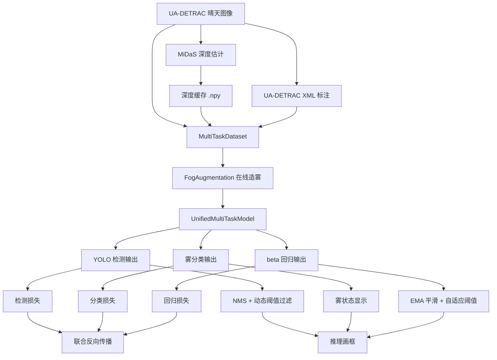

# 高速公路团雾监测毕业设计项目总说明文档

更新日期：2026-03-15

## 一、文档定位与更新说明

本文档是当前仓库 `D:\BS` 对应毕业设计项目的正式总说明文档，用于统一回答以下问题：

- 这个项目到底要解决什么问题。
- 项目的核心技术路线是什么。
- 各个目录、各个模块分别负责什么。
- 训练阶段、推理阶段、导出阶段的真实调用链路是什么。
- 当前项目已经完成到什么程度，哪些能力已经真实打通，哪些地方仍然存在限制。

与旧版总说明相比，本版文档已经根据最近一轮代码更新进行了同步修订，重点修正了两个已经过时的结论：

1. 旧版文档曾把检测分支描述为“尚未真正接入联合训练”。这一说法现在已经不准确。当前 `src/train.py` 已经把检测标注、Ultralytics 检测损失、雾分类损失和 `beta` 回归损失一起纳入统一优化，检测分支已经真实参与联合训练。
2. 旧版文档曾把推理阶段描述为“尚未真正画出检测框”。这一说法现在也已经不准确。当前 `src/inference.py` 已经完成了检测输出张量的 NMS 后处理、动态置信度过滤、坐标缩放和 `cv2.rectangle` 绘框，推理阶段已经可以真正把检测框画到视频帧上。

因此，本版文档不是对旧文档做局部补丁，而是基于当前仓库实际代码状态的一次正式重写。本文档可直接用于毕业论文写作准备、项目中后期汇报、答辩材料支撑、项目交接与后续维护说明。

## 二、项目摘要

本项目面向“高速公路团雾监测”这一智能交通视觉感知场景，围绕“晴天交通数据复用 + 深度估计 + 基于大气散射模型的在线造雾 + 统一多任务学习 + 视频推理展示 + ONNX 导出部署”构建了一套完整的工程原型。

项目的核心思想并不是直接等待大量真实雾天数据，而是从可获得的晴天交通数据出发，利用 MiDaS 深度估计模型预生成深度图，再通过大气散射模型在训练阶段在线合成多种雾态样本，最终把这些样本送入一个共享 YOLO 主干的统一多任务模型，同时学习三类任务：

- 车辆检测任务；
- 雾类型分类任务；
- `beta` 散射系数回归任务。

当前仓库中的主模型是 `UnifiedMultiTaskModel`。该模型以 YOLOv11s 为共享骨干和检测头，同时在高层语义特征上挂接雾分类头和 `beta` 回归头。训练阶段，输入不是离线保存好的雾图，而是“清晰图像 + 深度图 + XML 检测标注”，由 `FogAugmentation` 在 GPU 上在线生成雾图和雾标签；推理阶段，系统会在视频帧上同时输出雾状态、`beta` 估计值、动态置信度阈值以及真实检测框。

从当前工程状态看，本项目已经不是一个零散脚本集合，而是一个具备以下闭环能力的毕业设计原型：

- 数据读取与样本组织；
- 深度图预计算与缓存；
- 在线物理一致性造雾；
- 检测、雾分类、`beta` 回归联合训练；
- 视频级推理与可视化展示；
- ONNX 导出；
- 量化感知训练与 INT8 转换预留。

## 三、课题背景、问题来源与研究意义

团雾是高速公路场景中最危险的低能见度天气现象之一。其典型特点不是“整段道路持续均匀起雾”，而是“局部区域突然起雾、浓度不均、变化快速、可见距离骤降”。这类现象对驾驶员极不友好，因为前车、车道线、护栏和远处交通参与者会在很短时间内变得难以辨认，进而诱发追尾、连环事故和大面积交通拥堵。

传统的团雾监测主要依赖人工经验、能见度仪、少量固定传感器或者简单图像统计方法。这些方法通常存在三个问题：

- 覆盖范围有限，难以随摄像头网络大规模扩展。
- 对局部、突发、不均匀的团雾适应性较差。
- 很难把天气感知结果直接与下游视觉任务联动起来。

基于视频的视觉感知方法具有明显优势。高速公路沿线本身通常已经部署了相机或监控系统，如果能够直接从视频中识别雾状态、估计能见度相关参数，并进一步感知车辆，那么系统就可以同时服务于环境认知和交通监测两个方向。

不过，这类课题的最大现实难点在于真实雾天数据稀缺且标注成本高。特别是“真实团雾 + 多角度视频 + 完整检测标注 + 可用于监督的雾强度标签”几乎不可能系统采集。基于这一现实约束，本项目采用了“真实晴天交通数据 + 预训练深度估计 + 物理启发造雾”的技术路径，其研究意义主要体现为：

- 在样本难获取条件下，利用深度与物理模型构造近似可信的雾天监督。
- 不只做单一天气分类，而是同时学习环境状态与目标检测，提高模型共享表示的价值。
- 为后续“低能见度条件下的鲁棒检测”“边缘端部署”“交通风险预警”等方向提供工程基础。

## 四、项目总体目标与当前阶段定位

结合当前代码、目录、模型和产物，本项目的总体目标可以归纳为以下四点：

1. 基于高速公路交通视频构建一个可运行的团雾监测系统原型。
2. 使用晴天 UA-DETRAC 数据、MiDaS 深度估计和大气散射模型生成雾化训练样本，解决真实雾天数据不足的问题。
3. 基于 YOLO 共享主干构建统一多任务模型，联合完成车辆检测、雾类型分类和 `beta` 回归。
4. 打通训练、推理、模型导出和展示文档链路，形成一个可答辩、可演示、可继续扩展的毕业设计工程。

从阶段定位上看，本项目已经不再是“只有想法没有系统”，也不再是“只有雾分类支线、检测还是空壳”。当前最准确的定位应当是：

**本项目已经完成“检测 + 雾分类 + `beta` 回归”统一模型的基本工程闭环，并已在推理端实现真实检测框绘制；但由于当前可用权重仍来自旧版本模型，检测头存在部分参数形状不匹配后跳过加载的问题，因此系统功能已经打通，检测效果仍需要基于新训练流程重新训练与进一步校准。**

这一定义非常重要。它说明当前项目的“系统能力”与“最终效果水平”要分开理解：

- 从系统能力看，联合训练和绘框推理都已经接上了。
- 从效果水平看，检测分支还没有用新的单类检测头权重充分训练到稳定状态。

## 五、项目总体技术路线

项目当前采用的是一条相对完整且具有工程可执行性的技术路线，其主线如下：

1. 读取 UA-DETRAC 晴天车辆视频序列及 XML 检测标注。
2. 使用 MiDaS 对原始清晰图像预计算深度图并缓存到磁盘。
3. 训练时通过 `MultiTaskDataset` 同时读取清晰图像、深度图和检测框标注。
4. 通过 `FogAugmentation` 在 GPU 上在线生成三种天气样本：`clear`、`uniform fog`、`patchy fog`。
5. 把在线生成的雾图输入 `UnifiedMultiTaskModel`。
6. 模型共享 YOLOv11s 主干特征，分别输出：
   - 检测分支预测；
   - 雾类型分类 logits；
   - `beta` 回归值。
7. 训练阶段使用统一损失函数对三项任务联合优化。
8. 推理阶段对检测输出做 NMS，再结合 `beta` 的 EMA 平滑结果计算动态阈值，最后在视频帧上绘制真实检测框。
9. 导出阶段把模型导出为 ONNX，并为 TensorRT / Jetson 部署提供示例。

为了便于理解，项目当前的全链路可以概括为如下关系：

## 六、项目当前真实完成度概览

基于当前仓库内容和最近一次联调结果，可以把项目完成情况概括为以下事实：

- 已完成原始数据读取与序列级训练/验证划分。
- 已完成 MiDaS 深度图预计算与深度缓存管理。
- 已完成基于大气散射模型的在线造雾增强。
- 已完成单类 `vehicle` 检测头改造。
- 已完成检测分支损失接入联合训练。
- 已完成推理阶段的检测框真实绘制。
- 已完成旧权重在检测头形状变化后的兼容加载逻辑。
- 已完成 ONNX 导出脚本。
- 已完成中期答辩 PPT 自动生成脚本。

另外，项目中已经做过一轮烟雾级验证，确认以下事实成立：

- `py_compile` 通过，说明关键源码文件语法正常。
- 联合训练烟雾测试可以成功前向和反向传播。
- 推理烟雾测试可以返回 `(probs, beta, detections)`。
- 绘框函数 `_draw_detections()` 可以在空检测结果和非空检测结果下正常运行。
- 使用项目内的 `test_video.mp4` 抽样运行 10 帧时，系统已经能够输出并绘制检测框，说明推理链路不是“只有数值输出，没有可视化”。

## 七、仓库结构与目录职责

当前项目根目录的主要结构如下：

- `src/`：核心业务代码目录，是项目的真实主线。
- `configs/`：配置示例文件目录，更多是参考而不是当前唯一配置源。
- `data/`：原始数据目录，保存 UA-DETRAC 图像和 XML。
- `outputs/`：输出目录，保存深度缓存、模型权重、离线雾图、导出文件和答辩材料。
- `python/`：项目自带 Python 运行环境。
- `PROJECT_OVERVIEW.md`：当前总说明文档。
- `MIDTERM_DEFENSE_ARCHITECTURE.md`：中期答辩架构说明。
- `generate_midterm_defense_ppt.py`：中期答辩 PPT 生成脚本。
- `config.py`：旧 checkpoint 兼容层。

`src/` 下的核心代码模块如下：

- `src/config.py`：全局配置中心。
- `src/data/dataset.py`：联合训练数据集定义。
- `src/data/depth_estimator.py`：MiDaS 深度估计与缓存预计算。
- `src/data/preparer.py`：离线 YOLO 数据集准备器。
- `src/model/fog_augmentation.py`：在线造雾增强模块。
- `src/model/unified_model.py`：统一多任务模型。
- `src/train.py`：联合训练入口。
- `src/inference.py`：视频推理入口。
- `src/export.py`：ONNX 导出入口。
- `src/utils.py`：权重加载、checkpoint 选择和通用工具函数。

需要特别说明的是，当前项目存在两条“数据准备思路”：

1. 当前主训练链路：直接读取原始清晰图像、深度缓存和 XML 标注，在训练时在线造雾，然后联合训练。
2. 离线辅助链路：将已生成的雾图整理成 `YOLO_Dataset_Patchy`，用于独立 YOLO 检测实验或数据核查。

这意味着 `outputs/YOLO_Dataset_Patchy` 依然有价值，但它已经不是当前联合训练脚本的唯一输入来源。

## 八、运行环境、工程依赖与平台特征

从当前仓库实际情况看，项目具有明显的 Windows + GPU + 本地固定环境特征。

### 1. 运行环境特征

- 当前工作目录为 `D:\BS`。
- 仓库内自带本地 Python 解释器 `D:\BS\python\python.exe`。
- 项目默认优先使用 CUDA，`src/config.py` 中会自动根据 `torch.cuda.is_available()` 选择设备。
- 推理脚本在 CUDA 环境下启用三段异步流：预处理流、推理流、后处理流。

### 2. 主要依赖

从代码实际使用情况看，项目核心依赖包括：

- `torch`
- `torchvision`
- `ultralytics`
- `opencv-python`
- `numpy`
- `Pillow`
- `tqdm`
- `onnx`
- `python-pptx`

其中：

- `MiDaS` 深度估计依赖 `torch.hub` 拉取或读取缓存模型。
- 检测损失和推理后处理依赖 `ultralytics` 内部实现。
- 导出脚本对 `onnx` 有显式依赖。

### 3. 编码与工程规范状态

前期项目曾出现中文注释在 Windows PowerShell 5.1 管道中被错误编码为问号的问题。经过整治后，`src/` 下 Python 源码已统一规范化为适合 Windows 环境读取的 UTF-8 编码方案，并且推理、训练和注释文件的中文可读性已经显著改善。

这一点虽然不是算法核心，但对毕业设计项目的最终交付非常重要，因为它直接影响：

- 指导老师查阅源码时的可读性；
- 答辩后归档文档和代码的稳定性；
- Windows 环境下的长期维护体验。

## 九、数据资源、样本规模与当前统计

项目当前基于 UA-DETRAC 数据集组织数据，真实盘点结果如下：

### 1. 原始数据

- 训练序列总数：60 个。
- 训练图像总数：83,791 帧。
- 测试序列总数：40 个。
- 测试图像总数：56,340 帧。
- 训练 XML 标注文件：60 份。

### 2. 当前联合训练的序列级划分结果

`MultiTaskDataset` 采用序列级 80/20 划分，而不是按帧随机打散。当前实际统计为：

- 训练序列：48 个。
- 训练样本：66,241 张。
- 验证序列：12 个。
- 验证样本：17,550 张。

采用序列级划分的原因非常明确：交通视频中相邻帧和同一视频序列具有强相关性。如果按帧随机切分，训练集与验证集会包含大量相似内容，导致验证结果失真。当前做法显著降低了数据泄漏风险，属于比较规范的时间序列/视频数据处理方式。

### 3. 深度缓存

当前 `outputs/Depth_Cache` 中已有深度缓存约 23,053 份。与 66,241 张训练样本相比，这说明深度缓存尚未完全覆盖全量训练样本。训练脚本中的 `precompute_depths()` 会在正式训练前自动补算缺失的缓存文件。

### 4. 离线雾图

当前 `outputs/Processed_Patchy_Data` 中已有约 3,203 张离线雾图，这些数据主要用于离线整理、展示或辅助构建独立 YOLO 数据集，并不替代当前联合训练主链路中的在线造雾。

### 5. 离线 YOLO 数据集

当前 `outputs/YOLO_Dataset_Patchy` 中已有：

- `images/train`：2,603 张；
- `images/val`：600 张；
- `labels/train`：2,603 份；
- `labels/val`：600 份。

并已生成单类 `vehicle` 的 `data.yaml`。

这说明项目既保留了“主训练在线生成样本”的路径，也保留了“离线导出检测数据集”的工程能力，后续可用于横向实验对比。

## 十、配置体系设计

项目当前采用“代码配置为主、YAML 配置为辅”的配置方式。

### 1. 真实配置源

当前真正被训练、推理和导出脚本直接使用的是 `src/config.py` 中的 `Config` 类。该配置集中维护了：

- 数据目录与输出目录；
- `XML_DIR`；
- `NUM_DET_CLASSES = 1`；
- `DET_CLASS_NAMES = ["vehicle"]`；
- `NUM_FOG_CLASSES = 3`；
- 训练超参数；
- `BETA_MIN / BETA_MAX / A_MIN / A_MAX`；
- 推理阈值参数；
- 多任务损失权重。

### 2. 关键配置项含义

当前有几个配置项对理解系统非常关键：

- `NUM_DET_CLASSES = 1`：说明检测任务当前被定义为单类车辆检测，而不是沿用 COCO 80 类。
- `BASE_CONF_THRES = 0.25`：推理时的基础检测显示阈值。
- `EMA_ALPHA = 0.1`：对 `beta` 的平滑系数。
- `DET_LOSS_WEIGHT / FOG_CLS_LOSS_WEIGHT / FOG_REG_LOSS_WEIGHT`：三项任务损失的加权系数。
- `USE_IMAGENET_NORMALIZE = False`：当前输入默认不做 ImageNet 标准化，训练和推理两端保持一致。

### 3. 兼容层

根目录下的 `config.py` 不是主配置逻辑，而是一个兼容层。它存在的原因是旧 checkpoint 在保存时记录了 `config.Config` 的模块路径。保留这个别名后，旧模型权重可以被 `torch.load()` 恢复而不需要额外的自定义反序列化钩子。

这体现出项目在迭代过程中开始考虑“旧产物如何继续使用”的工程问题。

## 十一、数据层设计与职责划分

### 1. `MultiTaskDataset` 的职责

`src/data/dataset.py` 中的 `MultiTaskDataset` 是当前联合训练的真正入口。它每次返回四类信息：

- `image_tensor`：清晰原图；
- `depth_tensor`：与图像对应的深度图；
- `det_cls_tensor`：当前图像中所有检测目标的类别；
- `det_box_tensor`：当前图像中所有检测目标的归一化 `xywh` 框。

其内部流程包括：

1. 扫描原始图像目录中的视频序列。
2. 按序列做训练/验证划分。
3. 记录每一帧的图像路径、所属序列和文件名。
4. 预加载所选序列的 XML 标注，避免 `__getitem__` 时反复解析磁盘。
5. 根据文件名提取帧号，找到对应帧的车辆框。
6. 把 DETRAC 的绝对坐标框转换为 YOLO 风格的归一化 `xywh`。

这个设计很关键。它意味着当前联合训练主线并不是“先合成雾图再标注”，而是“清晰图像 + 深度图 + 原始检测框”一起读入，后续在 GPU 上统一完成雾化与监督构造。

### 2. `DepthEstimator` 的职责

`src/data/depth_estimator.py` 中的 `DepthEstimator` 使用 MiDaS 预训练模型生成单张图像的深度估计结果。其输出深度经过归一化和方向调整后，遵循如下语义：

- `0` 近似表示近处；
- `1` 近似表示远处。

这一深度定义与雾建模直接相关，因为在大气散射模型中，远处区域通常应当具有更明显的可见度衰减。

配套的 `precompute_depths()` 会遍历整个数据集，对不存在的 `.npy` 缓存进行补算。这保证了训练时不会在每个 batch 临时跑深度估计，从而显著降低训练开销。

### 3. `DatasetPreparer` 的职责

`src/data/preparer.py` 中的 `DatasetPreparer` 仍然保留着重要作用。它负责把离线雾图和 XML 标注整理成 YOLO 训练格式，包括：

- 目录结构创建；
- XML 解析；
- YOLO 标签写出；
- 训练/验证序列随机划分；
- `data.yaml` 生成。

虽然当前主线已经不再依赖它做联合训练，但它仍然具备两个价值：

- 用于独立的单任务检测实验；
- 用于核查和展示离线造雾数据集的可用性。

## 十二、在线造雾模块设计

`src/model/fog_augmentation.py` 是本项目最有研究辨识度的模块之一。它不是普通的颜色抖动，而是基于深度图和大气散射原理构造雾化样本。

### 1. 输入与输出

输入：

- 清晰图像张量 `images`，形状 `(B, 3, H, W)`；
- 深度图张量 `depths`，形状 `(B, 1, H, W)`。

输出：

- 合成后的雾图 `foggy_images`；
- 雾类型标签 `fog_types`；
- 当前样本对应的 `beta` 值 `final_betas`。

### 2. 雾类型定义

当前实现中有三类天气标签：

- `0 = clear`：无雾；
- `1 = uniform`：均匀雾；
- `2 = patchy`：团雾。

### 3. 核心物理思路

模块本质上遵循了大气散射模型的思想：

`I(x) = J(x) * t(x) + A * (1 - t(x))`

其中：

- `I(x)` 是观察到的有雾图像；
- `J(x)` 是清晰图像；
- `A` 是大气光；
- `t(x)` 是透射率。

当前实现中透射率由 `beta` 和有效深度共同决定，近似形式为：

`t(x) = exp(-beta * d_eff(x))`

### 4. `uniform fog` 的实现

在均匀雾模式下：

- 为每个样本随机采样 `beta`；
- 为每个样本随机采样大气光 `A`；
- 使用深度图乘以固定放大因子构造有效深度；
- 对透射率做裁剪，避免图像过黑或过白。

其效果是整幅图上的雾效主要由几何深度决定，而不是局部噪声决定。

### 5. `patchy fog` 的实现

在团雾模式下：

- 先在低分辨率空间生成随机噪声；
- 再通过双三次插值扩展到原图大小；
- 将该低频噪声与深度图相乘，形成空间分布不均匀的有效深度；
- 再用相同的散射公式生成局部浓淡不均的团雾。

也就是说，`patchy fog` 不是简单地在图上涂一层半透明白雾，而是让“深度”和“低频空间分布”共同决定雾浓度。这种设计虽然仍然是近似仿真，但已经明显优于普通随机增强。

### 6. `clear` 的实现

当样本被随机分配为 `clear` 类型时，最终会把其 `beta` 显式置零。这保证了模型能够同时看到“无雾”和“有雾”样本，并学到天气状态之间的区分。

## 十三、统一多任务模型设计

`src/model/unified_model.py` 中的 `UnifiedMultiTaskModel` 是项目当前的核心模型。

### 1. 总体结构

模型采用“YOLO 主干共享特征 + 多头输出”的设计：

- YOLOv11s Backbone / Neck；
- YOLO Detect Head；
- 雾分类头；
- `beta` 回归头。

其中高层共享特征来自 YOLO 网络中的 SPPF 附近输出。代码会在逐层前向时尝试捕获这一高语义特征图，并把它同时送给雾分类头和回归头。

### 2. 检测头改造

当前模型不再沿用原始 COCO 多类检测头，而是把检测任务收缩为单类 `vehicle` 检测：

- `NUM_DET_CLASSES = 1`
- `DET_CLASS_NAMES = ["vehicle"]`

如果加载的 YOLO 基础权重本身类别数不是 1，模型会重新构建一个新的 `DetectionModel`，然后只加载那些形状能够对齐的预训练参数。这种做法有两个效果：

- 保留了大部分 backbone / neck 的预训练能力；
- 把检测头切换到了更符合本课题需求的单类车辆检测任务上。

### 3. 雾分类头

分类头的结构是：

- 自适应平均池化；
- 展平；
- 线性层；
- ReLU；
- Dropout；
- 输出 3 类 logits。

该头负责预测：

- `CLEAR`
- `UNIFORM FOG`
- `PATCHY FOG`

### 4. `beta` 回归头

回归头比分类头更轻，输出流程为：

- 自适应平均池化；
- 展平；
- 线性层；
- ReLU；
- 线性层；
- `Sigmoid`

其输出范围为 `[0, 1]`，在训练和推理中再乘以 `cfg.BETA_MAX` 得到实际 `beta` 数值范围。

### 5. 训练态与推理态输出差异

这一点对理解后续调用链非常关键：

- 在 `model.train()` 模式下，模型返回的是 Ultralytics 检测损失可以直接消费的原始检测预测结构。
- 在 `model.eval()` 模式下，模型会从复杂输出结构中提取出可用于推理和 NMS 的纯检测张量。

这使得一个模型同时满足了：

- 训练阶段需要原始结构来算 detection loss；
- 推理阶段需要简洁张量来做后处理和绘框。

### 6. 量化支持

模型中已经包含：

- `QuantStub`
- `DeQuantStub`
- `fuse_model()`

这些设计说明项目不仅考虑了训练和展示，也提前预留了量化感知训练和部署优化路径。

## 十四、联合训练流程与损失设计

`src/train.py` 是当前训练主入口。与旧版文档描述不同，现在的训练已经是真正的三任务联合训练。

### 1. 训练前准备

训练入口会依次完成：

1. 设置多进程启动方式；
2. 构建 `Config`；
3. 固定随机种子；
4. 构建 `UnifiedMultiTaskModel`；
5. 构建 `FogAugmentation`；
6. 构建 `MultiTaskDataset`；
7. 调用 `precompute_depths()` 补齐深度缓存；
8. 创建 `DataLoader`；
9. 初始化优化器、学习率调度器和 AMP。

### 2. `multitask_collate_fn()` 的作用

由于不同图像中的检测框数量不一样，训练脚本专门实现了 `multitask_collate_fn()`。它会把每张图像中的框整理为 Ultralytics 检测损失所需的扁平形式：

- `batch_idx`
- `cls`
- `bboxes`

这一步是检测分支真正能参与联合训练的关键接口之一。

### 3. 每个 batch 的真实流动

当前每个 batch 的逻辑可以概括为：

1. 从数据集取出清晰图像、深度图和检测框标注。
2. 把图像和深度图送入 `FogAugmentation`，生成雾图、雾类别标签和 `beta` 标签。
3. 将雾图送入统一模型，得到：
   - `det_preds`
   - `pred_cls`
   - `pred_reg`
4. 用 `model.yolo.loss(det_batch, preds=det_preds)` 计算检测损失。
5. 用 `CrossEntropyLoss` 计算雾分类损失。
6. 用 `MSELoss` 计算 `beta` 回归损失。
7. 把三者加权求和，得到总损失后执行反向传播。

### 4. 当前总损失形式

当前训练总损失可以形式化表示为：

`Loss_total = w_det * Loss_det + w_cls * Loss_fog_cls + w_reg * Loss_fog_reg`

其中：

- `w_det = DET_LOSS_WEIGHT`
- `w_cls = FOG_CLS_LOSS_WEIGHT`
- `w_reg = FOG_REG_LOSS_WEIGHT`

在当前配置中，三者默认都为 `1.0`。

### 5. 检测损失的具体来源

检测损失不是手写的简化版本，而是直接调用 Ultralytics 内部检测损失实现。当前联调中，检测损失返回的是三项分量：

- `box`
- `cls`
- `dfl`

训练代码会对这三项求和，再按 batch 大小做归一，从而得到本批次的检测损失。

### 6. 反向传播如何更新模型

由于三项损失都是从同一次前向传播得到的，因此在执行 `loss.backward()` 之后：

- 检测分支的梯度会更新 YOLO 检测头和共享主干；
- 雾分类损失的梯度会更新雾分类头和共享主干；
- `beta` 回归损失的梯度会更新回归头和共享主干。

这意味着共享主干接收到的是三路任务共同传回的梯度信号，而不是只被单一路径训练。当前模型因此已经具备了真正的多任务联合学习属性。

### 7. AMP、checkpoint 与续训

训练脚本在 CUDA 环境下默认启用 AMP，以降低显存压力并提升吞吐。同时它支持：

- 自动发现最新 checkpoint；
- 训练中断后自动续训；
- 保留最近若干 checkpoint；
- 保存最佳 FP32 权重；
- 保存最终 FP32 权重。

当前 `outputs/Fog_Detection_Project/checkpoints` 下已有 3 个 FP32 checkpoint，说明这条训练主线至少已经在真实环境中跑通过。

### 8. QAT 与 INT8

当前训练脚本仍保留了：

- QAT 前模块融合；
- `prepare_qat`；
- 量化 observer 管理；
- INT8 转换尝试。

因此，从工程路线看，本项目不仅是“会训模型”，还提前纳入了部署优化思路。

## 十五、推理流程、画框逻辑与当前状态说明

`src/inference.py` 中的 `HighwayFogSystem` 是当前实时推理入口。与旧版状态相比，它已经不再只是显示雾状态和 `beta`，而是可以真正画出检测框。

### 1. 推理阶段整体流程

当前推理链路如下：

1. 自动解析可用模型权重路径；
2. 构建统一多任务模型；
3. 加载权重；
4. 对视频帧进行预处理；
5. 前向得到检测输出、雾分类 logits 和 `beta` 回归值；
6. 对检测输出做 NMS；
7. 对 `beta` 做 EMA 平滑；
8. 根据平滑后的 `beta` 计算动态显示阈值；
9. 过滤检测结果；
10. 把检测框、类别名、分数和雾状态一起绘制到画面上。

### 2. 检测后处理

当前代码中，推理时会先用较低的阈值做一次 NMS：

- `conf_thres = 0.05`
- `iou_thres = 0.45`

这样做的目的是尽量先保留候选框，避免在雾天场景下因为过早过滤导致漏检。随后系统再结合当前 `beta` 的平滑结果动态计算最终显示阈值。

### 3. `beta` 与动态阈值

系统会对 `beta` 做 EMA 平滑，计算方式由 `EMA_ALPHA = 0.1` 控制。其意义在于减小单帧回归抖动，防止画面显示和检测阈值随着瞬时预测大幅波动。

平滑后的 `beta` 会影响最终的 `adaptive_conf`。直观上可以理解为：

- 雾越重，系统越倾向于降低显示阈值，尽量保留低置信度候选；
- 雾越轻，系统越接近基础置信度阈值。

这也是本项目“环境感知反向影响检测策略”的核心思想体现。

### 4. 真实绘框已经完成

当前 `_draw_detections()` 已经完成了以下步骤：

- 用 `adaptive_conf` 过滤 NMS 后结果；
- 使用 `scale_boxes` 将框从模型输入尺度映射回显示帧尺度；
- 用 `cv2.rectangle` 绘制边框；
- 用 `cv2.putText` 绘制类别和置信度；
- 统计可见检测框数量并叠加到画面。

这说明推理界面现在不只是“显示状态栏”，而是“状态栏 + 检测框 + 文本标签”的完整视频展示。

### 5. 当前旧权重的现实局限

尽管功能已经接通，但当前可加载的主权重 `outputs/Fog_Detection_Project/unified_model.pt` 仍然是旧版本保存的结果。由于现在检测头已经从原来的类别配置切换为单类 `vehicle`，加载旧权重时会出现部分参数形状不匹配。

为了解决这个问题，`src/utils.py` 中的 `load_model_weights()` 已经实现“跳过形状不匹配键”的兼容加载逻辑。因此当前会出现如下现象：

- 权重可以加载成功；
- 共享主干和大部分可对齐参数会被恢复；
- 新检测头中形状不匹配的参数会被跳过加载。

这带来的直接结果是：

- 系统现在可以真正画框；
- 但因为检测头并非完整继承自同结构已训练模型，当前框的质量可能不稳定，可能出现天空、反光区或高亮区域的误检。

因此，当前“画框功能已经实现”和“检测效果仍需重新训练”这两个判断需要同时成立，不能混为一谈。

### 6. 当前推理链路的实际验证状态

最近一次联调已经确认：

- 空白帧测试下推理函数可正常返回；
- 绘框函数在空结果下不会崩溃；
- 使用 `test_video.mp4` 抽取多帧时，系统已经能输出实际检测框；
- 项目中已额外保存一张示例结果 `outputs/inference_box_smoke.jpg`，可作为当前推理可视化链路已贯通的证据。

## 十六、权重加载兼容与模型版本演进

`src/utils.py` 中的 `load_model_weights()` 是这次工程更新里非常重要的一环。它的意义在于：允许模型结构发生局部变化后，旧权重仍然尽可能复用。

当前逻辑会：

1. 读取权重文件；
2. 兼容纯 `state_dict` 与包含 `model_state_dict` 的 checkpoint；
3. 遍历权重键；
4. 仅加载那些“键名存在且张量形状一致”的参数；
5. 把形状不匹配的键记录到 `skipped_mismatched_keys`。

这种机制在当前项目中解决的是一个非常实际的问题：

- 旧模型：检测头类别结构与当前不同；
- 新模型：检测头已经切换为 `vehicle` 单类；
- 如果强制 `strict=True` 加载，模型根本无法启动；
- 采用“选择性加载”后，模型可以继续用于调试、推理链路验证和过渡训练。

这体现出项目已从“实验性脚本”进化到“考虑模型演进兼容性”的工程化阶段。

## 十七、导出与部署准备

`src/export.py` 提供了当前统一模型的 ONNX 导出能力。其主要职责包括：

- 自动寻找最适合的权重文件；
- 构建统一模型并加载权重；
- 构造虚拟输入执行 `torch.onnx.export`；
- 导出三路输出：
  - 检测输出；
  - 雾分类输出；
  - `beta` 回归输出；
- 打印 TensorRT INT8 构建示例；
- 输出 Jetson 部署提示。

当前仓库中已经存在：

- `outputs/unified_multitask.onnx`
- `outputs/_smoke_unified_multitask.onnx`

这表明 ONNX 导出不是纸面设计，而是已经跑通过的能力。

结合训练脚本中的 QAT / INT8 路线和导出脚本中的 TensorRT 说明，可以看出项目的部署思路已经比较清晰：

- 训练阶段：得到 FP32 模型并尝试 QAT / INT8；
- 导出阶段：转 ONNX；
- 部署阶段：进入 TensorRT / Jetson。

虽然当前仓库尚未展示完整的 Jetson 实测性能报告，但部署路径已经明确。

## 十八、答辩材料自动生成能力

项目中还包含一个容易被忽略但很有价值的部分：`generate_midterm_defense_ppt.py`。

该脚本不是简单拼接几页文字，而是基于 `python-pptx` 编程方式自动生成中期答辩演示文稿。它可以把以下内容自动写入 PPT：

- 项目背景与意义；
- 技术路线；
- 架构设计；
- 数据与样本统计；
- 训练与推理流程；
- 导出与部署思路；
- 当前完成度与后续计划。

当前仓库中的 `outputs/Midterm_Defense_Presentation.pptx` 就是这条链路的直接产物。

从毕业设计的完整性角度看，这说明项目作者不仅在做模型本身，也在同步建设汇报与材料自动化能力。这种能力对答辩准备、阶段汇报和后续版本更新都非常有帮助。

## 十九、当前关键产物一览

基于当前仓库盘点，较重要的阶段产物包括：

- `outputs/Fog_Detection_Project/unified_model.pt`
  当前主模型权重。
- `outputs/Fog_Detection_Project/checkpoints/checkpoint_epoch_0001.pt`
- `outputs/Fog_Detection_Project/checkpoints/checkpoint_epoch_0002.pt`
- `outputs/Fog_Detection_Project/checkpoints/checkpoint_epoch_0003.pt`
  当前保留的 FP32 训练 checkpoint。
- `outputs/unified_multitask.onnx`
  当前主要 ONNX 导出文件。
- `outputs/_smoke_unified_multitask.onnx`
  导出烟雾测试产物。
- `outputs/inference_box_smoke.jpg`
  推理绘框链路已经跑通的示例图。
- `outputs/Midterm_Defense_Presentation.pptx`
  中期答辩演示文稿。
- `outputs/fog_labels.txt`
  离线造雾标签记录文件。

这些产物共同说明，项目已经覆盖了“训练模型、保存权重、推理展示、导出模型、生成材料”几个关键层面。

## 二十、项目当前优势

从毕业设计项目的综合质量看，本项目当前有以下明显优势：

### 1. 技术路线完整

项目不是单一模型实验，而是把数据、深度、造雾、联合训练、推理、导出和答辩材料串成了完整流程。

### 2. 研究问题明确

课题始终围绕高速公路团雾监测这一实际问题展开，不是脱离应用场景的纯算法拼接。

### 3. 工程结构清晰

项目目录分层明确，核心逻辑集中在 `src/`，代码组织已经具备可维护性。

### 4. 在线造雾具有辨识度

利用深度图和大气散射模型做在线雾化，是本项目最有特色的技术点之一。

### 5. 多任务设计合理

共享主干、检测头、分类头和回归头的组合兼顾了研究目标与工程复杂度。

### 6. 已经开始考虑部署

QAT、INT8、ONNX、TensorRT、Jetson 提示等内容说明项目已经超出“只在训练机上跑通”的初级阶段。

## 二十一、当前不足、风险与需要实事求是说明的地方

尽管当前项目功能已经比旧版文档描述更完整，但在最终答辩时仍然需要对以下问题保持诚实和清醒：

### 1. 检测头效果尚未完成新权重充分训练

当前最需要说明的风险不是“功能没接上”，而是“结构接上了，但权重还需要新训练流程充分适配”。因此当前推理中出现低分误检并不意外。

### 2. 深度缓存尚未覆盖全量训练集

虽然脚本可自动补算，但这会给首次全量训练带来时间成本。

### 3. `requirements.txt` 仍不是完全可复现清单

项目当前更依赖仓库自带的 `python/` 环境，而不是纯粹依赖 `pip install -r requirements.txt` 一键复现。

### 4. 仍缺乏最终版定量实验报告

从代码与产物看，工程闭环已经搭好，但论文与答辩所需要的系统性量化结果，例如：

- 雾分类准确率；
- `beta` 回归误差；
- 检测在不同雾态下的性能对比；
- 联合训练相对单任务训练的增益；

这些结果仍需要进一步实验整理。

### 5. 推理后处理仍可继续加强

当前推理已经能画框，但若想显著减少误检，仍建议继续加入：

- 更严格的显示阈值策略；
- ROI 区域过滤；
- 异常框尺寸与长宽比过滤；
- 新权重重新训练后的效果校正。

## 二十二、后续优化方向

面向毕业设计最终收尾，当前最值得优先推进的工作包括：

1. 用新的单类检测头结构重新进行完整联合训练，获得真正匹配当前模型定义的权重。
2. 对推理阶段继续做误检抑制，尤其是天空区域、反光区域和异常小框过滤。
3. 系统整理实验指标与可视化结果，形成论文和答辩需要的量化证据。
4. 统一配置入口，减少“代码配置”和“示例 YAML”之间的割裂。
5. 完善根目录 README，把本总说明文档作为详细说明，把 README 作为快速入口。
6. 对部署链路做至少一次实际设备验证，哪怕是小规模的 Jetson 或 TensorRT 试运行结果。

## 二十三、结论

综合当前代码、目录、模型、产物和最近一次功能更新，可以对本毕业设计项目作出如下正式结论：

本项目已经围绕“高速公路团雾监测”构建出一套较为完整的视觉感知工程原型。它并不是简单调用一个现成模型完成单一分类，而是从真实晴天交通数据出发，结合 MiDaS 深度估计、大气散射模型在线造雾、YOLOv11s 共享主干、多任务联合学习、视频推理展示和 ONNX 导出，形成了一个具有明确技术主线和工程闭环的毕业设计系统。

更重要的是，经过本轮更新之后，项目状态已经发生了实质性变化：检测分支已经真实接入联合训练，推理阶段也已经能真正绘制检测框。这意味着项目当前的系统形态，已经从“雾感知主线较完整、检测只是预留接口”的中期原型，进一步发展为“检测、雾分类和 `beta` 回归三任务结构均已打通”的更完整版本。

当然，当前系统仍需进一步完成与新结构相匹配的充分训练，才能把“功能打通”真正提升为“效果稳定”。但从毕业设计的项目完整性、工程层次和继续收束空间来看，当前基础已经非常扎实。只要后续继续补充新权重训练、误检抑制和实验量化，本项目完全具备收束为一份有说服力毕业设计最终成果的条件。
