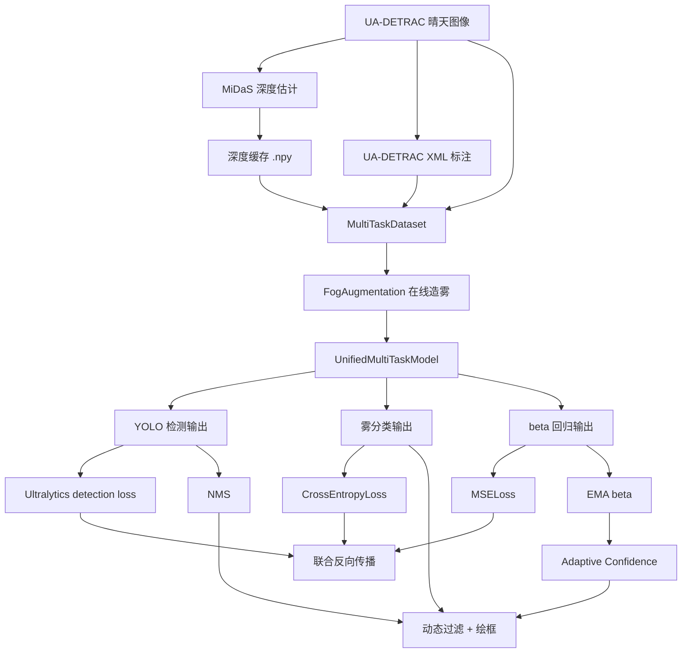

# 高速公路团雾监测项目 README

更新日期：2026-04-07

## 项目概述

本项目面向高速公路低能见度场景，围绕“团雾识别 + 车辆检测 + 雾强度回归”构建了一套多任务视觉原型系统。核心思路不是等待大量真实雾天数据，而是复用 UA-DETRAC 晴天交通数据，结合 MiDaS 深度估计和基于大气散射模型的在线造雾，在训练阶段动态生成 `clear / uniform / patchy` 三类天气样本。

当前主模型为 `UnifiedMultiTaskModel`，默认以 `yolo11n.pt` 为共享检测骨干，同时输出：

- 单类 `vehicle` 检测结果
- 雾类型分类结果
- `beta` 散射系数回归结果

训练阶段主链路为：

`清晰图像 + 深度缓存 + XML 标注 -> 在线造雾 -> 多任务联合训练`

推理阶段主链路为：

`视频帧 -> 统一模型 -> 雾分类 + beta + NMS -> EMA 平滑 -> 动态阈值绘框`

## 当前状态

当前仓库已经完成以下主线能力：

- UA-DETRAC 原始数据读取与序列级 train/val 划分
- MiDaS 深度缓存预计算与加载
- 基于深度图的大气散射在线造雾
- 单类 `vehicle` 检测头适配
- 检测、雾分类、`beta` 回归三任务联合训练
- 视频推理、NMS、动态阈值和真实绘框
- ONNX 导出入口
- QAT 和 INT8 转换代码路径

当前工作区的真实状态也需要明确说明：

- UA-DETRAC 数据当前已经整理到 `data/UA-DETRAC/...` 目录结构下，与 [src/config.py](./src/config.py) 的默认路径约定一致
- `outputs/Depth_Cache/`、`outputs/Fog_Detection_Project/` 和 `checkpoints/` 会在首次运行配置或训练脚本时自动创建，但不随 Git 提交
- 当前工作区未附带现成训练权重、checkpoint、ONNX 或 INT8 引擎文件
- 根目录现已提供 `requirements.txt` 和 `requirements-dev.txt`，用于补齐核心运行依赖与开发工具依赖
- 根目录现已提供 [scripts/smoke_test.py](./scripts/smoke_test.py)，用于做阶段一的训练前自检

这意味着：代码主线已经打通，但模型效果、权重文件和导出产物是否存在，取决于当前工作区是否实际执行过训练或导出。

## 技术路线



## 核心设计

### 1. 数据层

主训练数据集是 `src/data/dataset.py` 中的 `MultiTaskDataset`，每个样本返回：

- 清晰图像张量
- 对应深度图张量
- 当前帧所有检测类别
- 当前帧所有检测框

关键约束：

- 按视频序列而不是按帧切分 train/val，避免相邻帧泄漏
- 深度缓存命名规则固定为 `序列名_图像名.npy`
- 检测监督来自 UA-DETRAC XML
- 输入空间默认走 letterbox，对训练和推理保持一致

### 2. 在线造雾

`src/model/fog_augmentation.py` 中的 `FogAugmentation` 在 GPU 上实时生成三类天气：

- `clear`
- `uniform`
- `patchy`

其核心公式遵循大气散射思想：

`I(x) = J(x) * t(x) + A * (1 - t(x))`

其中透射率由 `beta` 和深度共同决定。`patchy` 模式会额外引入低频噪声，模拟局部浓淡不均的团雾。

### 3. 统一多任务模型

`src/model/unified_model.py` 中的 `UnifiedMultiTaskModel` 使用 YOLO 主干共享特征，并在高层共享特征上接两个附加头：

- 雾分类头：输出 3 类 logits
- `beta` 回归头：输出 `[0, 1]` 范围的归一化值，后续再按 `BETA_MAX` 缩放

检测任务当前明确收敛为：

- `NUM_DET_CLASSES = 1`
- `DET_CLASS_NAMES = ["vehicle"]`

如果加载的基础 YOLO 权重类别数和当前任务不一致，模型会重建单类检测头，并只加载形状匹配的参数。

### 4. 联合训练

`src/train.py` 已经把三项任务一起纳入统一优化：

- 检测损失：直接调用 Ultralytics detection loss
- 雾分类损失：`CrossEntropyLoss`
- `beta` 回归损失：`MSELoss`

总损失形式为：

`Loss_total = w_det * Loss_det + w_cls * Loss_fog_cls + w_reg * Loss_fog_reg`

默认三个权重都为 `1.0`。

### 5. 推理与动态阈值

`src/inference.py` 中的 `HighwayFogSystem` 在推理时会：

1. 对视频帧做 letterbox 预处理
2. 前向得到检测输出、雾分类 logits 和 `beta`
3. 对检测输出做 NMS
4. 对 `beta` 做 EMA 平滑
5. 根据平滑后的 `beta` 调整最终显示阈值
6. 把框、类别名、分数和雾状态一起绘制到视频帧

这条链路的核心思想是：环境感知结果会反向影响检测显示策略。

## 目录结构

当前仓库的主要结构如下：

```text
D:\BS
├─ config.py                     # 旧 checkpoint 兼容层
├─ pyproject.toml                # 格式化 / 类型检查配置
├─ README.md
├─ configs/                      # YAML 示例配置，不是主流程真实配置源
├─ data/                         # UA-DETRAC 原始数据
├─ outputs/                      # 运行产物（已被 .gitignore 忽略）
├─ python/                       # 本地 Python 运行环境
├─ scripts/
│  ├─ generate_line_by_line_docs.py
│  └─ precompute_depth_cache.py
└─ src/
   ├─ config.py
   ├─ train.py
   ├─ inference.py
   ├─ export.py
   ├─ utils.py
   ├─ data/
   │  ├─ dataset.py
   │  ├─ depth_estimator.py
   │  └─ preparer.py
   └─ model/
      ├─ fog_augmentation.py
      └─ unified_model.py
```

## 数据资源与当前统计

基于当前工作区的实际盘点：

- UA-DETRAC 训练序列：`60`
- UA-DETRAC 训练图像：`83,791`
- UA-DETRAC 测试序列：`40`
- UA-DETRAC 测试图像：`56,340`
- 训练 XML 标注文件：`60`

按当前默认 `FRAME_STRIDE = 1` 和序列级 `80/20` 划分：

- 训练序列：`48`
- 训练样本：`66,241`
- 验证序列：`12`
- 验证样本：`17,550`

当前深度缓存覆盖情况：

- `outputs/Depth_Cache/` 中已有 `66,241` 个 `.npy` 文件
- 在默认训练划分下，这已经覆盖当前训练集样本数

需要注意的是，`README` 不再默认宣称存在离线雾图、离线 YOLO 数据集、ONNX 或 checkpoint，因为这些产物在当前工作区里并不存在，且本身也不纳入版本控制。

## 配置体系

### 真实配置源

训练、推理、导出真正使用的是 [src/config.py](./src/config.py) 中的 `Config` 类。

`configs/*.yaml` 当前更多用于：

- 示例展示
- 文档说明
- 参数对照

它们不是训练脚本、推理脚本和导出脚本的真实唯一配置入口。

### 顶层兼容层

根目录的 [config.py](./config.py) 只是兼容层，用于兼容旧 checkpoint 里保存的 `config.Config` 模块路径。

### 关键配置项

当前最关键的配置项包括：

- `YOLO_BASE_MODEL = "yolo11n.pt"`
- `NUM_DET_CLASSES = 1`
- `DET_CLASS_NAMES = ["vehicle"]`
- `NUM_FOG_CLASSES = 3`
- `IMG_SIZE = 512`
- `FRAME_STRIDE`
- `PRECOMPUTE_DEPTH_CACHE`
- `BASE_CONF_THRES = 0.25`
- `EMA_ALPHA = 0.1`
- `USE_IMAGENET_NORMALIZE = False`

## 环境与依赖

当前仓库在工程层面的约定已经收口为：

- 命令默认在仓库根目录执行
- Python 解释器默认使用当前已激活环境中的 `python`
- 数据、缓存、输出和 checkpoint 默认按仓库相对路径解析
- 默认设备自动检测 CUDA；也可以通过环境变量强制切到 CPU 或指定其它路径

关键依赖来自代码实际使用：

- `torch`
- `torchvision`
- `ultralytics`
- `opencv-python`
- `numpy`
- `Pillow`
- `tqdm`
- `onnx`
- `tensorrt`（可选，仅导出部署链路用）

补充说明：

- `pyproject.toml` 当前只提供 `black`、`mypy`、`ruff` 相关配置，不是完整依赖锁定文件
- `requirements.txt` 现提供核心运行依赖，`requirements-dev.txt` 现提供开发工具依赖
- `tensorrt` 仍因平台差异未纳入默认 pip 清单
- `MiDaS` 通过 `torch.hub` 加载，首次运行可能依赖联网或本地缓存
- `src/__init__.py`、`src.data` 和 `src.model` 现在采用懒加载导出，避免仅导入配置模块时就被 `ultralytics` 等重依赖阻断

## 常用命令

以下命令均假定你已进入仓库根目录，并且 `python` 指向当前项目要使用的环境。

### 1. 安装运行依赖

```bash
python -m pip install -r requirements.txt
```

如果你还需要格式化、类型检查等开发工具：

```bash
python -m pip install -r requirements-dev.txt
```

### 2. 训练前 smoke test

先做基础环境、路径和数据索引检查：

```bash
python scripts/smoke_test.py
```

如果还想额外验证模型可以成功初始化并完成一次随机张量前向：

```bash
python scripts/smoke_test.py --check-forward
```

### 3. 数据审计与样例可视化

阶段二的数据链路校验脚本会输出：

- `outputs/Data_Audit/dataset_audit_report.json`
- `outputs/Data_Audit/dataset_audit_report.md`
- `outputs/Data_Audit/visualizations/` 下的样例图

```bash
python scripts/check_dataset.py
```

### 4. 预计算深度缓存

```bash
python scripts/precompute_depth_cache.py
```

### 5. 训练

训练入口现在会先检查训练集和验证集的深度缓存覆盖情况；只要任一侧存在缺失文件，就会自动补算缺失部分。显式设置 `BS_PRECOMPUTE_DEPTH_CACHE=1` 时，则会强制进入预计算流程。

```bash
python src/train.py
```

如果希望训练前自动补算深度缓存：

```bash
BS_PRECOMPUTE_DEPTH_CACHE=1 python src/train.py
```

如果只想做小规模训练闭环验证，而不是直接启动正式训练，可以用 smoke run：

```bash
BS_EPOCHS=1 \
BS_QAT_EPOCHS=0 \
BS_SKIP_QAT=1 \
BS_BATCH_SIZE=2 \
BS_IMG_SIZE=320 \
BS_NUM_WORKERS=0 \
BS_MAX_TRAIN_BATCHES=3 \
BS_MAX_VAL_BATCHES=2 \
python src/train.py
```

训练脚本现在会为每次运行自动创建独立运行目录：

- `outputs/Fog_Detection_Project/runs/<run_name>/config_snapshot.json`
- `outputs/Fog_Detection_Project/runs/<run_name>/metrics.jsonl`
- `outputs/Fog_Detection_Project/runs/<run_name>/summary.json`

### 6. 推理

```bash
python src/inference.py
```

默认逻辑会优先尝试：

- `outputs/Fog_Detection_Project/unified_model_best.pt`
- `outputs/Fog_Detection_Project/unified_model.pt`
- `outputs/Fog_Detection_Project/checkpoints/` 下最新 checkpoint

如果这些文件不存在，推理脚本会退回到随机初始化权重，以便做链路联调。

### 7. 导出 ONNX

```bash
python src/export.py
```

导出脚本会自动尝试解析最适合的权重文件；如果找不到，也允许在随机初始化权重下导出图结构。

### 8. 生成逐行说明文档

```bash
python scripts/generate_line_by_line_docs.py
```

## 训练相关环境变量

`src/config.py` 和 `src/utils.py` 当前支持通过环境变量做轻量覆盖：

- `BS_RAW_DATA_DIR`
  覆盖训练图像目录，避免为了切换数据根目录而改源码
- `BS_XML_DIR`
  覆盖 XML 标注目录
- `BS_DEPTH_CACHE_DIR`
  覆盖深度缓存目录
- `BS_OUTPUT_DIR`
  覆盖统一输出目录
- `BS_CHECKPOINT_DIR`
  覆盖 checkpoint 目录
- `BS_YOLO_BASE_MODEL`
  覆盖基础 YOLO 权重名或本地权重路径
- `BS_DEVICE`
  覆盖默认设备选择，例如 `cpu` 或 `cuda`
- `BS_FRAME_STRIDE`
  控制帧抽样步长，默认 `1`
- `BS_BATCH_SIZE`
  覆盖训练 batch size
- `BS_EPOCHS`
  覆盖 FP32 训练 epoch 数
- `BS_QAT_EPOCHS`
  覆盖 QAT 训练 epoch 数；设为 `0` 可直接跳过 QAT
- `BS_LR`
  覆盖 FP32 学习率
- `BS_QAT_LR`
  覆盖 QAT 学习率
- `BS_IMG_SIZE`
  覆盖训练与推理输入尺寸
- `BS_PRECOMPUTE_DEPTH_CACHE`
  为 `1/true/yes/on` 时，训练入口会强制执行预计算流程；即使未设置，只要 train/val 存在缺失缓存，也会自动补算
- `BS_SKIP_QAT`
  为 `1/true/yes/on` 时跳过 QAT/INT8 阶段
- `BS_DISABLE_AMP`
  为 `1/true/yes/on` 时在 CUDA 上禁用 AMP，便于排查数值稳定性问题
- `BS_MAX_TRAIN_BATCHES`
  限制每个训练 epoch 实际处理的 batch 数，适合 smoke run
- `BS_MAX_VAL_BATCHES`
  限制每个验证 epoch 实际处理的 batch 数，适合 smoke run
- `BS_GRAD_CLIP_NORM`
  启用梯度裁剪并设置最大范数；默认 `0` 表示关闭
- `BS_NONFINITE_GRAD_MIN_BATCHES`
  非有限梯度统计至少达到多少个 batch 后，才开始执行 warn/fail 阈值判断
- `BS_NONFINITE_GRAD_WARN_RATIO`
  非有限梯度 batch 占比达到该阈值时输出告警
- `BS_NONFINITE_GRAD_FAIL_RATIO`
  非有限梯度 batch 占比达到该阈值时直接中止训练
- `BS_NONFINITE_GRAD_FAIL_STREAK`
  只有连续多少个 epoch 都超过 `BS_NONFINITE_GRAD_FAIL_RATIO` 时，才真正中止训练
- `BS_SEED`
  覆盖训练随机种子
- `BS_NUM_WORKERS`
  覆盖 DataLoader `num_workers`
- `BS_PREFETCH_FACTOR`
  覆盖 DataLoader `prefetch_factor`
- `BS_PERSISTENT_WORKERS`
  控制 DataLoader `persistent_workers`
- `BS_CHECKPOINT_SAVE_INTERVAL`
  覆盖 checkpoint 保存间隔
- `BS_CHECKPOINT_KEEP_MAX`
  覆盖 checkpoint 历史保留数量
- `BS_CUDNN_DETERMINISTIC`
  控制 CuDNN 是否走确定性模式
- `BS_CUDNN_BENCHMARK`
  控制 CuDNN benchmark

## 已知限制

当前最需要实事求是说明的限制包括：

- 当前工作区未附带训练好的正式权重文件
- 若 `yolo11n.pt` 不在本地，首次模型初始化可能触发 Ultralytics 自动下载基础权重
- 若 `outputs/Fog_Detection_Project/` 下没有训练权重，推理脚本会退回随机初始化权重
- 由于 `outputs/` 被忽略，README 不能把“某个权重/某个 ONNX 已存在”写成固定事实
- 当前仅补齐了 pip 依赖清单，尚未提供包含系统库、CUDA 和 conda 元数据的完整锁定环境文件
- 最终论文所需的系统性量化实验结果仍需要单独整理

## 代码入口索引

- [src/config.py](./src/config.py)：真实配置源
- [src/data/dataset.py](./src/data/dataset.py)：联合训练数据集
- [src/data/depth_estimator.py](./src/data/depth_estimator.py)：MiDaS 深度估计与缓存
- [src/data/preparer.py](./src/data/preparer.py)：离线 YOLO 数据集准备器
- [src/model/fog_augmentation.py](./src/model/fog_augmentation.py)：在线造雾
- [src/model/unified_model.py](./src/model/unified_model.py)：统一多任务模型
- [src/train.py](./src/train.py)：训练入口
- [src/inference.py](./src/inference.py)：推理入口
- [src/export.py](./src/export.py)：导出入口
- [src/utils.py](./src/utils.py)：权重解析、checkpoint 选择、letterbox 工具

## 总结

当前版本的仓库已经具备一条完整的研究和工程主线：

- 数据可读
- 深度可算
- 雾可在线合成
- 三任务可联合训练
- 视频可实时推理和画框
- 模型可导出

这份 README 现在以“当前代码和当前工作区真实状态”为准，不再保留过期的中期材料、旧版产物清单或默认存在的权重断言。后续如果训练权重、ONNX 或部署结果进入工作区，应在此文件中按实际情况继续补充。
