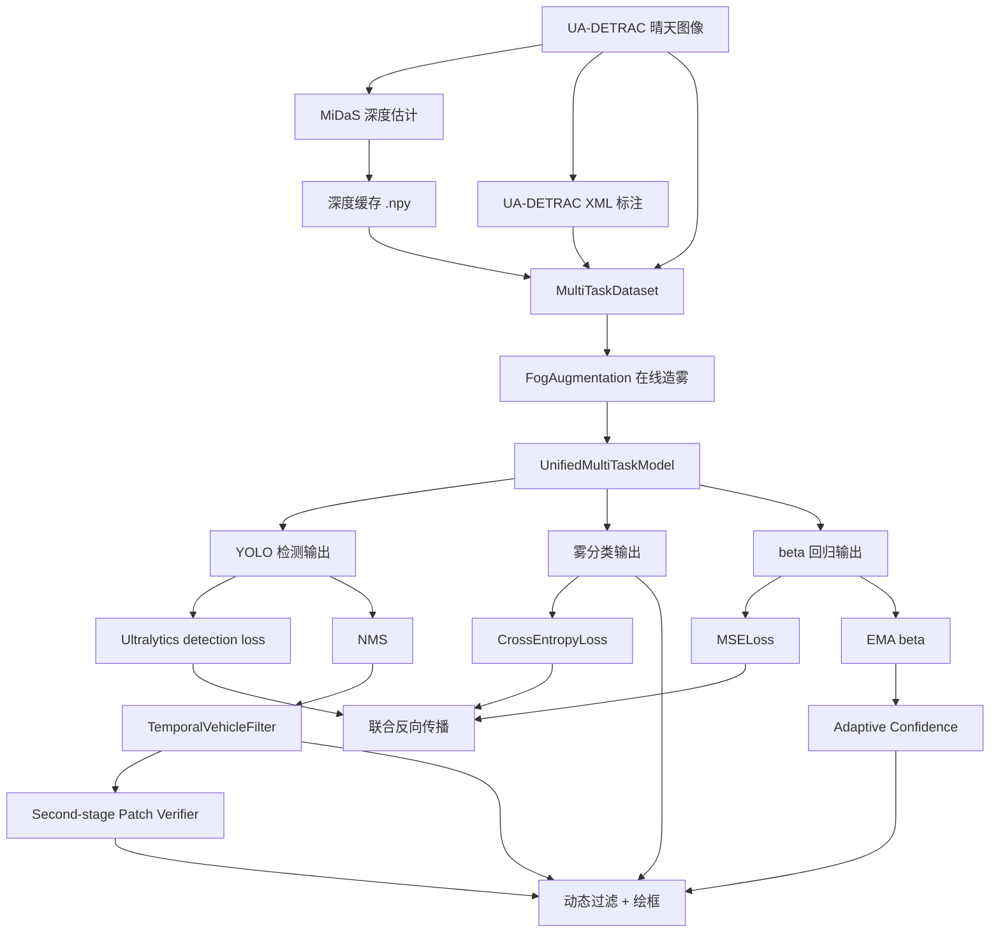

# 高速公路团雾监测项目 README

更新日期：2026-04-27

## 项目概述

本项目面向高速公路低能见度场景，围绕“团雾识别 + 车辆检测 + 雾强度回归”构建了一套多任务视觉原型系统。核心思路不是等待大量真实雾天数据，而是复用 UA-DETRAC 晴天交通数据，结合 MiDaS 深度估计和基于大气散射模型的在线造雾，在训练阶段动态生成 `clear / uniform / patchy` 三类天气样本。

当前主模型为 `UnifiedMultiTaskModel`，默认以 `yolo11n.pt` 为共享检测骨干，同时输出：

- 单类 `vehicle` 检测结果
- 雾类型分类结果
- `beta` 散射系数回归结果

训练阶段主链路为：

`清晰图像 + 深度缓存 + XML 标注 -> 在线造雾 -> 多任务联合训练`

推理阶段主链路为：

`视频帧 -> 统一模型 -> 雾分类 + beta + NMS -> 轨迹级时序过滤 -> EMA 平滑 -> 动态阈值绘框`

## 当前状态

当前仓库已经完成以下主线能力：

- UA-DETRAC 原始数据读取与序列级 train/val 划分
- MiDaS 深度缓存预计算与加载
- 基于深度图的大气散射在线造雾
- 单类 `vehicle` 检测头适配
- 检测、雾分类、`beta` 回归三任务联合训练
- 视频推理、NMS、动态阈值和真实绘框
- ONNX 导出入口
- QAT 和 INT8 转换代码路径
- 轨迹级车辆时序过滤与静止假车抑制
- 统一路线 / 混合路线共享的静止误检 benchmark 指标与轨迹日志
- 静止误检 patch 挖掘、人工复核包生成与 bootstrap hard negative 数据集收口
- 二次车辆 / 非车辆复核分类器训练与回接路径

当前工作区的真实状态也需要明确说明：

- UA-DETRAC 数据当前已经整理到 `data/UA-DETRAC/...` 目录结构下，与 [src/config.py](./src/config.py) 的默认路径约定一致
- `outputs/Depth_Cache/`、`outputs/Fog_Detection_Project/` 以及其下的 `checkpoints/` 会在首次运行配置或训练脚本时自动创建，但不随 Git 提交
- 当前默认输出目录下已经存在 `unified_model.pt`、`unified_model_best.pt` 和 `checkpoint_epoch_0001.pt` ~ `checkpoint_epoch_0003.pt`
- `outputs/unified_multitask.onnx` 当前也已经存在；但 TensorRT `engine` 和 INT8 导出产物在当前工作区中仍未发现
- `outputs/` 下还存在多组历史实验目录（如 `Fog_Detection_Project_fogbalance`、`Fog_Detection_Project_videoadapt` 等），但当前默认配置仍指向 `outputs/Fog_Detection_Project`
- 当前工作区还已经生成一批静止误检治理相关产物，例如：
  - `outputs/Route_Eval_temporal_smoke/`
  - `outputs/Static_False_Positive_Mine_temporal_smoke/`
  - `outputs/Static_False_Positive_Review_temporal_smoke/`
  - `outputs/Hard_Negatives_static_fp_v1/`
  - `outputs/Second_Stage_Vehicle_Classifier_v1/`
- 根目录现已提供 `requirements.txt` 和 `requirements-dev.txt`，用于补齐核心运行依赖与开发工具依赖
- 根目录现已提供 [scripts/smoke_test.py](./scripts/smoke_test.py)，用于做阶段一的训练前自检

这意味着：代码主线已经打通，而且当前工作区里确实存在一批训练和导出产物；但这些产物属于“当前这份工作区的真实状态”，不能等同于任意新克隆环境里的默认事实。默认输出目录下现有 run 记录以 `smoke_*` 为主，因此这些权重更适合视为链路验证或阶段性实验产物，而不是自动认定为最终正式模型。

## 技术路线



## 核心设计

### 1. 数据层

主训练数据集是 `src/data/dataset.py` 中的 `MultiTaskDataset`，每个样本返回：

- 清晰图像张量
- 对应深度图张量
- 当前帧所有检测类别
- 当前帧所有检测框

关键约束：

- 按视频序列而不是按帧切分 train/val，避免相邻帧泄漏
- 深度缓存命名规则固定为 `序列名_图像名.npy`
- 检测监督来自 UA-DETRAC XML
- 输入空间默认走 letterbox，对训练和推理保持一致

### 2. 在线造雾

`src/model/fog_augmentation.py` 中的 `FogAugmentation` 在 GPU 上实时生成三类天气：

- `clear`
- `uniform`
- `patchy`

其核心公式遵循大气散射思想：

`I(x) = J(x) * t(x) + A * (1 - t(x))`

其中透射率由 `beta` 和深度共同决定。`patchy` 模式会额外引入低频噪声，模拟局部浓淡不均的团雾。

### 3. 统一多任务模型

`src/model/unified_model.py` 中的 `UnifiedMultiTaskModel` 使用 YOLO 主干共享特征，并在高层共享特征上接两个附加头：

- 雾分类头：输出 3 类 logits
- `beta` 回归头：输出 `[0, 1]` 范围的归一化值，后续再按 `BETA_MAX` 缩放

检测任务当前明确收敛为：

- `NUM_DET_CLASSES = 1`
- `DET_CLASS_NAMES = ["vehicle"]`

如果加载的基础 YOLO 权重类别数和当前任务不一致，模型会重建单类检测头，并只加载形状匹配的参数。

### 4. 联合训练

`src/train.py` 已经把三项任务一起纳入统一优化：

- 检测损失：直接调用 Ultralytics detection loss
- 雾分类损失：`CrossEntropyLoss`
- `beta` 回归损失：`MSELoss`

总损失形式为：

`Loss_total = w_det * Loss_det + w_cls * Loss_fog_cls + w_reg * Loss_fog_reg`

当前代码默认权重为：

- `DET_LOSS_WEIGHT = 1.0`
- `FOG_CLS_LOSS_WEIGHT = 1.5`
- `FOG_REG_LOSS_WEIGHT = 1.25`

### 5. 推理与动态阈值

`src/inference.py` 中的 `HighwayFogSystem` 在推理时会：

1. 对视频帧做 letterbox 预处理
2. 前向得到检测输出、雾分类 logits 和 `beta`
3. 对检测输出做 NMS
4. 将检测框还原到原始帧坐标系
5. 使用 `TemporalVehicleFilter` 做轨迹级过滤
6. 对 `beta` 做 EMA 平滑
7. 根据平滑后的 `beta` 调整最终显示阈值
8. 把框、类别名、分数和雾状态一起绘制到视频帧

这条链路的核心思想是：环境感知结果会反向影响检测显示策略。

### 6. 视频级静止误检治理

当前版本新增了位于 `src/temporal_vehicle_filter.py` 的 `TemporalVehicleFilter`，
用于把“逐帧检测结果”升级成“轨迹级确认结果”。它主要解决的是：

- 长得像车的静止背景物体在多帧中持续误检为 `vehicle`
- 逐帧检测抖动导致的短暂误检和不稳定显示
- 统一推理路线、混合推理路线和离线 benchmark 的过滤逻辑不一致

当前实现会对每条轨迹维护：

- `tentative`
- `confirmed`
- `suspicious`
- `suppressed`

并统计以下特征：

- 连续命中帧数与连续丢失帧数
- 平均置信度
- 中心点位移
- 框面积变化
- 局部运动强度
- 可选道路 ROI 先验
- 可选二次外观复核概率

### 7. 二次外观复核与 hard negative 闭环

在时序过滤基础上，当前版本还新增了“可疑静止轨迹 -> patch 复核 -> hard negative 回灌”的完整工程链：

- `scripts/mine_static_false_positives.py`
  - 从 route eval 轨迹日志中导出静止可疑 patch
- `scripts/build_static_fp_review_pack.py`
  - 构建人工复核清单、联系图和初判摘要
- `scripts/build_bootstrap_hard_negative_set.py`
  - 从复核包中收口保守版 bootstrap 负样本
- `scripts/train_second_stage_vehicle_classifier.py`
  - 训练二次车辆 / 非车辆复核分类器

其中二次复核器默认支持两种模式：

- ImageNet 预训练多类车辆概率求和
- 项目内训练得到的二分类 `vehicle / non_vehicle` 权重

## 目录结构

当前仓库的主要结构如下：

```text
BS/
├─ config.py                          # 旧 checkpoint 兼容层
├─ pyproject.toml                     # black / ruff / mypy 配置
├─ requirements.txt
├─ requirements-dev.txt
├─ README.md
├─ yolo11n.pt                         # 当前工作区中的本地基础权重
├─ configs/                           # YAML 示例配置 + benchmark 视频/模型清单
├─ data/
│  ├─ UA-DETRAC/                      # 当前已整理好的真实数据目录
│  └─ *.zip                           # 原始压缩包缓存
├─ outputs/
│  ├─ Depth_Cache/                    # MiDaS 深度缓存
│  ├─ Fog_Detection_Project/          # 当前默认输出目录
│  ├─ Fog_Detection_Project_*/        # 历史实验输出目录
│  ├─ Data_Audit/                     # 数据审计报告与可视化
│  ├─ hybrid_infer/                   # 混合推理视频输出
│  ├─ Route_Eval*/                    # 统一/混合路线评估输出与轨迹日志
│  ├─ Static_False_Positive_*/        # 静止误检 patch、复核包与摘要
│  ├─ Hard_Negatives_static_fp_v1/    # bootstrap hard negative 数据集
│  └─ Second_Stage_Vehicle_Classifier_v1/  # 二次复核分类器权重与训练摘要
│  └─ unified_multitask.onnx          # 当前已导出的 ONNX
├─ scripts/
│  ├─ smoke_test.py
│  ├─ check_dataset.py
│  ├─ precompute_depth_cache.py
│  ├─ hybrid_fog_vehicle_infer.py
│  ├─ adapt_fog_to_video.py
│  ├─ evaluate_inference_routes.py
│  ├─ mine_static_false_positives.py
│  ├─ build_static_fp_review_pack.py
│  ├─ build_bootstrap_hard_negative_set.py
│  ├─ train_second_stage_vehicle_classifier.py
│  └─ generate_line_by_line_docs.py
└─ src/
   ├─ config.py
   ├─ train.py
   ├─ inference.py
   ├─ export.py
   ├─ temporal_vehicle_filter.py
   ├─ utils.py
   ├─ data/
   │  ├─ dataset.py
   │  ├─ depth_estimator.py
   │  └─ preparer.py
   └─ model/
      ├─ fog_augmentation.py
      └─ unified_model.py
```

## 数据资源与当前统计

以下统计基于当前工作区目录盘点，以及 `python scripts/smoke_test.py --full-depth-scan` 在 `2026-04-24` 的实测结果：

- UA-DETRAC 训练序列：`60`
- UA-DETRAC 训练图像：`83,791`
- UA-DETRAC 测试序列：`40`
- UA-DETRAC 测试图像：`56,340`
- 训练 XML 标注文件：`60`

按当前默认 `FRAME_STRIDE = 1` 和序列级 `80/20` 划分：

- 训练序列：`48`
- 训练样本：`67,790`
- 验证序列：`12`
- 验证样本：`16,001`

当前深度缓存覆盖情况：

- `outputs/Depth_Cache/` 中当前共有 `83,791` 个 `.npy` 文件
- 在默认 `FRAME_STRIDE = 1` 的 train/val 划分下，`67,790 + 16,001 = 83,791`
- `smoke_test --full-depth-scan` 已确认 train 和 val 两侧都没有缺失深度缓存

需要注意的是，虽然当前工作区里已经存在权重、checkpoint 和 ONNX，但这些都属于本地运行产物，仍然不应被当作 Git 仓库本身默认携带的固定内容。

## 配置体系

### 真实配置源

训练、推理、导出真正使用的是 [src/config.py](./src/config.py) 中的 `Config` 类。

`Config` 现在支持三种来源叠加：

- 源码中的默认值
- 环境变量覆盖
- 配置文件覆盖（`--config ...` 或 `BS_CONFIG_FILE=...`）

`configs/*.yaml` 当前仍然主要承担：

- 示例配置
- 文档说明
- 参数对照

但与之前不同的是：训练、推理、导出、自检和数据审计脚本现在都可以直接加载
`.json/.yaml/.yml` 配置文件；其中真正被 `Config` 消费到的字段会生效，未消费的字段
会在启动时给出 warning。

另外：

- `configs/benchmark_videos.json` 用于维护 benchmark 视频列表
- `configs/benchmark_models.json` 用于维护多模型 benchmark 基线列表

它们分别供 `scripts/evaluate_inference_routes.py`、`scripts/run_benchmark.sh`、
`scripts/run_multi_model_benchmark.py` 和 `scripts/run_multi_model_benchmark.sh`
复用。

### 顶层兼容层

根目录的 [config.py](./config.py) 只是兼容层，用于兼容旧 checkpoint 里保存的 `config.Config` 模块路径。

### 关键配置项

当前最关键的配置项包括：

- `YOLO_BASE_MODEL = "yolo11n.pt"`
- `NUM_DET_CLASSES = 1`
- `DET_CLASS_NAMES = ["vehicle"]`
- `NUM_FOG_CLASSES = 3`
- `IMG_SIZE = 512`
- `FRAME_STRIDE`
- `TRAIN_RATIO = 0.8`
- `PRECOMPUTE_DEPTH_CACHE`
- `BASE_CONF_THRES = 0.25`
- `EMA_ALPHA = 0.05`
- `DET_LOSS_WEIGHT = 1.0`
- `FOG_CLS_LOSS_WEIGHT = 1.5`
- `FOG_REG_LOSS_WEIGHT = 1.25`
- `FOG_CLEAR_PROB = 0.15`
- `FOG_UNIFORM_PROB = 0.35`
- `FOG_PATCHY_PROB = 0.50`
- `TEMPORAL_FILTER_ENABLED = True`
- `TEMPORAL_MIN_HITS = 3`
- `TEMPORAL_MAX_MISSING = 4`
- `TEMPORAL_STATIC_CENTER_SHIFT_THRES = 0.015`
- `TEMPORAL_STATIC_AREA_CHANGE_THRES = 0.12`
- `TEMPORAL_STATIC_MOTION_THRES = 0.035`
- `TEMPORAL_STATIC_FRAME_LIMIT = 8`
- `TEMPORAL_LOW_CONF_STATIC_SUPPRESS = 0.45`
- `TEMPORAL_ENABLE_SECOND_STAGE_CLASSIFIER = True`
- `USE_IMAGENET_NORMALIZE = False`

## 环境与依赖

当前仓库在工程层面的约定已经收口为：

- 命令默认在仓库根目录执行
- Python 解释器默认使用当前已激活环境中的 `python`
- 数据、缓存、输出和 checkpoint 默认按仓库相对路径解析
- 默认设备自动检测 CUDA；也可以通过环境变量强制切到 CPU 或指定其它路径

关键依赖来自代码实际使用：

- `torch`
- `torchvision`
- `ultralytics`
- `opencv-python`
- `numpy`
- `Pillow`
- `tqdm`
- `onnx`
- `tensorrt`（可选，仅导出部署链路用）

补充说明：

- `pyproject.toml` 当前只提供 `black`、`mypy`、`ruff` 相关配置，不是完整依赖锁定文件
- `requirements.txt` 现提供核心运行依赖，`requirements-dev.txt` 现提供开发工具依赖
- `tensorrt` 仍因平台差异未纳入默认 pip 清单
- `MiDaS` 通过 `torch.hub` 加载，首次运行可能依赖联网或本地缓存
- 当前工作区根目录已经包含 `yolo11n.pt`，因此默认模型初始化通常不需要再下载基础检测权重
- `src/__init__.py`、`src.data` 和 `src.model` 现在采用懒加载导出，避免仅导入配置模块时就被 `ultralytics` 等重依赖阻断

## 常用命令

以下命令均假定你已进入仓库根目录，并且 `python` 指向当前项目要使用的环境。

### 1. 安装运行依赖

```bash
python -m pip install -r requirements.txt
```

如果你还需要格式化、类型检查等开发工具：

```bash
python -m pip install -r requirements-dev.txt
```

### 2. 训练前 smoke test

先做基础环境、路径和数据索引检查：

```bash
python scripts/smoke_test.py
```

如果还想额外验证模型可以成功初始化并完成一次随机张量前向：

```bash
python scripts/smoke_test.py --check-forward
```

如果希望 smoke test 和某份配置文件保持一致：

```bash
python scripts/smoke_test.py --config configs/train.yaml --check-forward
```

### 3. 数据审计与样例可视化

阶段二的数据链路校验脚本会输出：

- `outputs/Data_Audit/dataset_audit_report.json`
- `outputs/Data_Audit/dataset_audit_report.md`
- `outputs/Data_Audit/visualizations/` 下的样例图

```bash
python scripts/check_dataset.py
```

或：

```bash
python scripts/check_dataset.py --config configs/train.yaml
```

### 4. 预计算深度缓存

```bash
python scripts/precompute_depth_cache.py
```

或：

```bash
python scripts/precompute_depth_cache.py --config configs/train.yaml
```

### 5. 训练

训练入口现在会先检查训练集和验证集的深度缓存覆盖情况；只要任一侧存在缺失文件，就会自动补算缺失部分。显式设置 `BS_PRECOMPUTE_DEPTH_CACHE=1` 时，则会强制进入预计算流程。

```bash
python src/train.py
```

如果希望直接从 YAML/JSON 配置文件启动训练：

```bash
python src/train.py --config configs/train.yaml
```

如果希望训练前自动补算深度缓存：

```bash
BS_PRECOMPUTE_DEPTH_CACHE=1 python src/train.py
```

如果只想做小规模训练闭环验证，而不是直接启动正式训练，可以用 smoke run：

```bash
BS_EPOCHS=1 \
BS_QAT_EPOCHS=0 \
BS_SKIP_QAT=1 \
BS_BATCH_SIZE=2 \
BS_IMG_SIZE=320 \
BS_NUM_WORKERS=0 \
BS_MAX_TRAIN_BATCHES=3 \
BS_MAX_VAL_BATCHES=2 \
python src/train.py
```

训练脚本现在会为每次运行自动创建独立运行目录：

- `outputs/Fog_Detection_Project/runs/<run_name>/config_snapshot.json`
- `outputs/Fog_Detection_Project/runs/<run_name>/metrics.jsonl`
- `outputs/Fog_Detection_Project/runs/<run_name>/summary.json`

如果希望补正式的雾头实验，而不是继续做 smoke run，仓库里已经提供了一条固定化命令：

```bash
bash scripts/run_fogfocus_full_train.sh
```

该脚本默认会：

- 从 `outputs/Fog_Detection_Project_fogfocus/checkpoints/checkpoint_epoch_0004.pt` 继续训练
- `FREEZE_YOLO_FOR_FOG=1`
- `DET_LOSS_WEIGHT=0`
- 去掉 `MAX_TRAIN_BATCHES / MAX_VAL_BATCHES` 限制
- 输出到 `outputs/Fog_Detection_Project_fogfocus_full/`

如果希望针对 `benchmark_v1` 暴露出的 clear-weather control clips 检测缺口继续训练，
仓库现在还提供一条“clear detection preserve”路线：

```bash
bash scripts/run_clear_det_preserve_train.sh
```

这条脚本默认会：

- 从 `outputs/Fog_Detection_Project_fogfocus_full/checkpoints/checkpoint_epoch_0012.pt` 继续训练
- 解冻 YOLO 检测器
- 保留 fog 分类 / beta 回归任务
- 额外打开 `CLEAR_DET_LOSS_WEIGHT`，在原始 clear 图上计算辅助检测损失
- 输出到 `outputs/Fog_Detection_Project_clearpreserve/`

如果希望直接改检测头策略，而不是继续在单类检测头上微调损失权重，
仓库现在还提供一条“保留 COCO 检测头”的 pilot 路线：

```bash
bash scripts/run_coco_vehicle_head_pilot.sh
```

该路线默认会：

- 加载 `configs/coco_vehicle_head_pilot.yaml`
- 把 `DET_HEAD_MODE` 切到 `coco_vehicle`
- 保留 COCO 80 类检测头，不再重建单类检测头
- 从 `fogfocus_full` 权重做非严格 model-only 恢复
- 在训练时把 UA-DETRAC 车辆统一映射到 COCO `car` 类
- 在推理时把 COCO 车辆类折叠回单一 `vehicle`

与这条训练脚本配套的实验资产包括：

- `docs/experiments/fogfocus_fulltrain_record_template.md`
- `docs/experiments/thesis_result_tables_template.md`

如果训练完成后希望自动补齐：

- 单模型 route eval
- 候选模型与 baseline 集合的横向对比
- 实验摘要 Markdown / JSON

可以继续执行：

```bash
python scripts/postprocess_fogfocus_full.py
```

### 6. 推理

```bash
python src/inference.py
```

如果希望直接使用推理配置文件：

```bash
python src/inference.py --config configs/inference.yaml
```

默认逻辑会优先尝试：

- `outputs/Fog_Detection_Project/unified_model_best.pt`
- `outputs/Fog_Detection_Project/unified_model.pt`
- `outputs/Fog_Detection_Project/checkpoints/` 下最新 checkpoint

如果这些文件不存在，推理脚本会退回到随机初始化权重，以便做链路联调。

### 7. 导出 ONNX

```bash
python src/export.py
```

如果希望导出时沿用训练配置文件中的关键字段：

```bash
python src/export.py --config configs/train.yaml
```

导出脚本会自动尝试解析最适合的权重文件；如果找不到，也允许在随机初始化权重下导出图结构。

### 8. 生成逐行说明文档

```bash
python scripts/generate_line_by_line_docs.py
```

### 9. 对比统一推理与混合方案

该脚本会离线采样视频帧，对比：

- 统一模型方案：`HighwayFogSystem`
- 混合方案：`HighwayFogSystem` + 独立 `yolo11n.pt`

输出包括：

- `outputs/Route_Eval/route_eval_summary.json`
- `outputs/Route_Eval/route_eval_summary.md`
- `outputs/Route_Eval/benchmark_overview.csv`
- 每个视频一个 `frame_metrics.csv`
- 每个视频各自的：
  - `unified_track_log.jsonl`
  - `hybrid_track_log.jsonl`
  - `unified_filter_frames.jsonl`
  - `hybrid_filter_frames.jsonl`
- 若干差异代表帧 `preview_*.jpg`

```bash
python scripts/evaluate_inference_routes.py \
  --video gettyimages-1353950094-640_adpp.mp4 \
  --sample-stride 5 \
  --max-frames 300
```

现在也支持通过 benchmark 配置文件一次性评估多段视频：

```bash
python scripts/evaluate_inference_routes.py \
  --benchmark-config configs/benchmark_videos.json \
  --output-dir outputs/Benchmark_v1
```

当前 `benchmark_v1` 已经包含：

- 1 段真实 fog 视频
- 4 段由 UA-DETRAC 序列导出的真实 clear-weather control clips

如果这些 control clips 需要重建，可执行：

```bash
python scripts/build_benchmark_assets.py
```

如果希望在 route eval 中显式接入自训练的二次复核分类器：

```bash
BS_TEMPORAL_SECOND_STAGE_CLASSIFIER_WEIGHTS=/abs/path/to/second_stage_vehicle_classifier_best.pt \
python scripts/evaluate_inference_routes.py \
  --video gettyimages-1353950094-640_adpp.mp4 \
  --sample-stride 5 \
  --max-frames 300
```

### 10. 挖掘静止误检 patch

当 route eval 已经生成轨迹日志后，可以直接挖掘静止可疑 / 已抑制的 patch：

```bash
python scripts/mine_static_false_positives.py \
  --route-eval-summary outputs/Route_Eval/route_eval_summary.json \
  --output-dir outputs/Static_False_Positive_Mine
```

核心输出：

- `static_false_positive_manifest.jsonl`
- `static_false_positive_manifest_summary.json`
- `static_false_positive_manifest_summary.md`
- 按 `route/video` 分目录保存的 patch 图像

### 11. 构建人工复核包

```bash
python scripts/build_static_fp_review_pack.py \
  --manifest outputs/Static_False_Positive_Mine/static_false_positive_manifest.jsonl \
  --output-dir outputs/Static_False_Positive_Review
```

核心输出：

- `review_checklist.csv`
- `review_checklist.md`
- `contact_sheet_all.jpg`
- `contact_sheet_route_unified.jpg`
- `contact_sheet_route_hybrid.jpg`

### 12. 构建 bootstrap hard negative 集

```bash
python scripts/build_bootstrap_hard_negative_set.py \
  --review-csv outputs/Static_False_Positive_Review/review_checklist.csv \
  --patch-root outputs/Static_False_Positive_Mine \
  --output-dir outputs/Hard_Negatives_static_fp_v1
```

核心输出：

- `bootstrap_hard_negative_manifest.jsonl`
- `bootstrap_hard_negative_summary.json`
- `bootstrap_hard_negative_summary.md`
- `images/` 下的负样本 patch

### 13. 训练二次车辆 / 非车辆复核分类器

```bash
python scripts/train_second_stage_vehicle_classifier.py \
  --review-csv outputs/Static_False_Positive_Review/review_checklist.csv \
  --patch-root outputs/Static_False_Positive_Mine \
  --output-dir outputs/Second_Stage_Vehicle_Classifier_v1
```

核心输出：

- `second_stage_vehicle_classifier_best.pt`
- `training_summary.json`
- `train_manifest.jsonl`
- `val_manifest.jsonl`

训练完成后，可通过：

```bash
BS_TEMPORAL_SECOND_STAGE_CLASSIFIER_WEIGHTS=/abs/path/to/second_stage_vehicle_classifier_best.pt
```

把权重重新接回 route eval、统一推理和混合推理链路。

### 14. 运行基准 benchmark

仓库现在提供一条固定化 benchmark 命令：

```bash
bash scripts/run_benchmark.sh
```

默认行为：

- 从 `configs/benchmark_videos.json` 读取视频列表
- 只运行其中 `status=active` 或 `enabled=true` 的条目
- 自动解析当前最适合的雾模型权重
- 输出到 `outputs/Benchmark_v1/`
- 生成：
  - `route_eval_summary.json`
  - `route_eval_summary.md`
  - `benchmark_overview.csv`
  - 每个视频各自的 `frame_metrics.csv` 与 `preview_*.jpg`

### 15. 运行多模型 benchmark

如果希望在同一组 benchmark 视频上横向比较多套雾模型权重，可以使用：

```bash
bash scripts/run_multi_model_benchmark.sh
```

默认行为：

- 从 `configs/benchmark_videos.json` 读取视频列表
- 只运行其中 `status=active` 或 `enabled=true` 的条目
- 从 `configs/benchmark_models.json` 读取模型基线列表
- 保留其中定义的 `role/status` 语义并写入汇总产物
- 逐个模型调用 `scripts/evaluate_inference_routes.py`
- 输出到 `outputs/Benchmark_Model_Compare_v1/`

核心输出包括：

- `model_overview.csv`
- `model_video_matrix.csv`
- `multi_model_benchmark_summary.json`
- `multi_model_benchmark_summary.md`

### 16. 对标单个候选模型

如果你刚训练出一套新权重，希望直接和当前 baseline 集合做横向对比，可以使用：

```bash
BS_CANDIDATE_WEIGHTS=/abs/path/to/unified_model_best.pt \
BS_CANDIDATE_LABEL=my_candidate \
bash scripts/run_candidate_benchmark.sh
```

也可以直接调用 Python 入口：

```bash
python scripts/benchmark_candidate_model.py \
  --candidate-weights /abs/path/to/unified_model_best.pt \
  --candidate-label my_candidate
```

默认行为：

- 从 `configs/benchmark_models.json` 读取 baseline 模型集合
- 把候选模型临时并入基线集合
- 自动调用多模型 benchmark
- 输出到 `outputs/Candidate_Benchmark_v1/`

核心输出包括：

- `candidate_benchmark_summary.json`
- `candidate_benchmark_summary.md`
- `multi_model/model_overview.csv`
- `multi_model/model_video_matrix.csv`

候选模型摘要现在会额外给出：

- overall pass / fail
- 每个 baseline 的 pass / fail
- 通过规则阈值（检测退化容忍度、稳定性恶化容忍度）

### 17. 运行单元测试

当前仓库已经补了一组针对配置、benchmark 工具链和时序过滤器的单元测试，主要覆盖：

- baseline / candidate 模型集合合并
- 排名与并列名次逻辑
- 多模型 leaderboard 生成
- 正式实验后处理摘要拼装
- 时序过滤状态机与静止误检抑制逻辑

运行方式：

```bash
python -m unittest discover -s tests -v
```

## 训练相关环境变量

`src/config.py` 和 `src/utils.py` 当前支持通过环境变量做轻量覆盖：

- `BS_CONFIG_FILE`
  指向 `.json/.yaml/.yml` 配置文件；适合让多条命令共享同一份配置覆盖
- `BS_RAW_DATA_DIR`
  覆盖训练图像目录，避免为了切换数据根目录而改源码
- `BS_XML_DIR`
  覆盖 XML 标注目录
- `BS_DEPTH_CACHE_DIR`
  覆盖深度缓存目录
- `BS_OUTPUT_DIR`
  覆盖统一输出目录
- `BS_CHECKPOINT_DIR`
  覆盖 checkpoint 目录
- `BS_YOLO_BASE_MODEL`
  覆盖基础 YOLO 权重名或本地权重路径
- `BS_DEVICE`
  覆盖默认设备选择，例如 `cpu` 或 `cuda`
- `BS_FRAME_STRIDE`
  控制帧抽样步长，默认 `1`
- `BS_TRAIN_RATIO`
  覆盖序列级训练集划分比例，默认 `0.8`
- `BS_BATCH_SIZE`
  覆盖训练 batch size
- `BS_EPOCHS`
  覆盖 FP32 训练 epoch 数
- `BS_QAT_EPOCHS`
  覆盖 QAT 训练 epoch 数；设为 `0` 可直接跳过 QAT
- `BS_LR`
  覆盖 FP32 学习率
- `BS_QAT_LR`
  覆盖 QAT 学习率
- `BS_IMG_SIZE`
  覆盖训练与推理输入尺寸
- `BS_PRECOMPUTE_DEPTH_CACHE`
  为 `1/true/yes/on` 时，训练入口会强制执行预计算流程；即使未设置，只要 train/val 存在缺失缓存，也会自动补算
- `BS_SKIP_QAT`
  为 `1/true/yes/on` 时跳过 QAT/INT8 阶段
- `BS_DISABLE_AMP`
  为 `1/true/yes/on` 时在 CUDA 上禁用 AMP，便于排查数值稳定性问题
- `BS_MAX_TRAIN_BATCHES`
  限制每个训练 epoch 实际处理的 batch 数，适合 smoke run
- `BS_MAX_VAL_BATCHES`
  限制每个验证 epoch 实际处理的 batch 数，适合 smoke run
- `BS_GRAD_CLIP_NORM`
  启用梯度裁剪并设置最大范数；默认 `0` 表示关闭
- `BS_NONFINITE_GRAD_MIN_BATCHES`
  非有限梯度统计至少达到多少个 batch 后，才开始执行 warn/fail 阈值判断
- `BS_NONFINITE_GRAD_WARN_RATIO`
  非有限梯度 batch 占比达到该阈值时输出告警
- `BS_NONFINITE_GRAD_FAIL_RATIO`
  非有限梯度 batch 占比达到该阈值时直接中止训练
- `BS_NONFINITE_GRAD_FAIL_STREAK`
  只有连续多少个 epoch 都超过 `BS_NONFINITE_GRAD_FAIL_RATIO` 时，才真正中止训练
- `BS_NONFINITE_GRAD_AUTO_DISABLE_AMP`
  为 `1/true/yes/on` 时，在满足 fail 条件后优先触发“自动关闭 AMP 并继续训练”的恢复路径
- `BS_SEED`
  覆盖训练随机种子
- `BS_NUM_WORKERS`
  覆盖 DataLoader `num_workers`
- `BS_PREFETCH_FACTOR`
  覆盖 DataLoader `prefetch_factor`
- `BS_PERSISTENT_WORKERS`
  控制 DataLoader `persistent_workers`
- `BS_CHECKPOINT_SAVE_INTERVAL`
  覆盖 checkpoint 保存间隔
- `BS_CHECKPOINT_KEEP_MAX`
  覆盖 checkpoint 历史保留数量
- `BS_FOG_CLEAR_PROB`
  覆盖在线造雾时 `clear` 类样本采样概率
- `BS_FOG_UNIFORM_PROB`
  覆盖 `uniform fog` 样本采样概率
- `BS_FOG_PATCHY_PROB`
  覆盖 `patchy fog` 样本采样概率
- `BS_FOG_BETA_MIN`
  覆盖在线造雾使用的最小 beta
- `BS_UNIFORM_DEPTH_SCALE`
  覆盖均匀雾模式的有效深度缩放系数
- `BS_PATCHY_DEPTH_BASE`
  覆盖团雾模式的基础深度项
- `BS_PATCHY_DEPTH_NOISE_SCALE`
  覆盖团雾模式的噪声深度放大系数
- `BS_DET_LOSS_WEIGHT`
  覆盖检测损失权重
- `BS_CLEAR_DET_LOSS_WEIGHT`
  覆盖 clear 图辅助检测损失权重；用于在在线造雾训练之外额外保住 clear-weather 检测能力
- `BS_DET_HEAD_MODE`
  控制检测头模式；当前支持 `single_vehicle` 和 `coco_vehicle`
- `BS_COCO_VEHICLE_TRAIN_CLASS_ID`
  在 `coco_vehicle` 模式下，训练时把 UA-DETRAC 车辆映射到哪个 COCO 类别，默认 `2`（car）
- `BS_FOG_CLS_LOSS_WEIGHT`
  覆盖雾分类损失权重
- `BS_FOG_REG_LOSS_WEIGHT`
  覆盖 beta 回归损失权重
- `BS_FOG_LABEL_SMOOTHING`
  覆盖雾分类标签平滑系数
- `BS_FOG_CLS_CLEAR_WEIGHT`
  覆盖 `clear` 类分类损失权重
- `BS_FOG_CLS_UNIFORM_WEIGHT`
  覆盖 `uniform` 类分类损失权重
- `BS_FOG_CLS_PATCHY_WEIGHT`
  覆盖 `patchy` 类分类损失权重
- `BS_EMA_ALPHA`
  覆盖推理阶段 beta EMA 平滑系数
- `BS_RESUME_CHECKPOINT`
  显式指定要恢复的 checkpoint 路径
- `BS_RESUME_MODEL_ONLY`
  为 `1/true/yes/on` 时只恢复模型参数，不恢复优化器/调度器/scaler 状态
- `BS_RESUME_NONSTRICT_MODEL_ONLY`
  为 `1/true/yes/on` 时，model-only 恢复会跳过 shape 不匹配权重，适合检测头结构迁移实验
- `BS_RESUME_RESET_EPOCH`
  为 `1/true/yes/on` 时，model-only 恢复后从 epoch 0 重新计数
- `BS_FREEZE_YOLO_FOR_FOG`
  为 `1/true/yes/on` 时冻结 YOLO 检测参数，仅做雾头适配式训练
- `BS_TEMPORAL_FILTER_ENABLED`
  为 `1/true/yes/on` 时启用轨迹级时序过滤
- `BS_TEMPORAL_MIN_HITS`
  目标至少连续命中多少帧后才进入 `confirmed`
- `BS_TEMPORAL_MAX_MISSING`
  轨迹最多允许连续丢失多少帧后归档
- `BS_TEMPORAL_IOU_MATCH_THRES`
  跨帧轨迹关联使用的 IoU 阈值
- `BS_TEMPORAL_STATIC_CENTER_SHIFT_THRES`
  判定“近乎静止”时的中心点位移阈值
- `BS_TEMPORAL_STATIC_AREA_CHANGE_THRES`
  判定“近乎静止”时的框面积变化阈值
- `BS_TEMPORAL_STATIC_MOTION_THRES`
  判定“近乎静止”时的局部运动强度阈值
- `BS_TEMPORAL_STATIC_FRAME_LIMIT`
  轨迹累计满足静止条件多少帧后，才进入静止可疑判定
- `BS_TEMPORAL_LOW_CONF_STATIC_SUPPRESS`
  低置信静止轨迹触发抑制的阈值
- `BS_TEMPORAL_ENABLE_ROAD_ROI_PRIOR`
  为 `1/true/yes/on` 时启用道路区域软先验
- `BS_TEMPORAL_ROAD_ROI_SCORE_THRES`
  道路区域先验分数低于该值时，可参与静止抑制判断
- `BS_TEMPORAL_ENABLE_SECOND_STAGE_CLASSIFIER`
  为 `1/true/yes/on` 时启用 patch 级二次外观复核
- `BS_TEMPORAL_SECOND_STAGE_VEHICLE_PROB_THRES`
  二次复核判为“像车”的概率阈值
- `BS_TEMPORAL_SECOND_STAGE_MODEL_NAME`
  当前支持 `mobilenet_v3_small`
- `BS_TEMPORAL_SECOND_STAGE_CLASSIFIER_WEIGHTS`
  指定项目内训练得到的二分类复核器权重；未设置时使用默认 ImageNet 模式
- `BS_CUDNN_DETERMINISTIC`
  控制 CuDNN 是否走确定性模式
- `BS_CUDNN_BENCHMARK`
  控制 CuDNN benchmark

## 已知限制

当前最需要实事求是说明的限制包括：

- 默认输出目录下虽然已有 `unified_model*.pt`、checkpoint 和 `outputs/unified_multitask.onnx`，但从现有 `runs/smoke_*` 记录看，至少其中一批产物来源于 smoke run / 小规模验证，不应直接等同于正式最终模型
- 当前工作区尚未发现 TensorRT `engine`、QAT INT8 权重等最终部署产物
- 当前 `outputs/` 下存在多组历史实验目录，但这些目录并不等于当前 `src/config.py` 默认输出路径
- 如果把本仓库迁移到新环境，`outputs/` 下的权重和 ONNX 依然不能被假定为必然存在，因为这些文件不随 Git 固定分发
- 当前仅补齐了 pip 依赖清单，尚未提供包含系统库、CUDA 和 conda 元数据的完整锁定环境文件
- 当前静止假车指标属于启发式工程指标，不等同于带人工逐轨迹标注的严格误检率
- 当前 bootstrap hard negative 集仍然很小，且主要来自单段真实雾视频，只能作为二次复核器的首轮启动数据
- 当前二次复核分类器已能训练和回接，但训练样本规模、类别平衡和泛化范围仍需继续扩充
- 最终论文所需的系统性量化实验结果仍需要单独整理

## 代码入口索引

- [src/config.py](./src/config.py)：真实配置源
- [src/data/dataset.py](./src/data/dataset.py)：联合训练数据集
- [src/data/depth_estimator.py](./src/data/depth_estimator.py)：MiDaS 深度估计与缓存
- [src/data/preparer.py](./src/data/preparer.py)：离线 YOLO 数据集准备器
- [src/model/fog_augmentation.py](./src/model/fog_augmentation.py)：在线造雾
- [src/model/unified_model.py](./src/model/unified_model.py)：统一多任务模型
- [src/temporal_vehicle_filter.py](./src/temporal_vehicle_filter.py)：轨迹级车辆时序过滤与二次外观复核
- [src/train.py](./src/train.py)：训练入口
- [src/inference.py](./src/inference.py)：推理入口
- [src/export.py](./src/export.py)：导出入口
- [src/utils.py](./src/utils.py)：权重解析、checkpoint 选择、letterbox 工具
- [scripts/smoke_test.py](./scripts/smoke_test.py)：训练前自检
- [scripts/check_dataset.py](./scripts/check_dataset.py)：数据审计与样例可视化
- [scripts/hybrid_fog_vehicle_infer.py](./scripts/hybrid_fog_vehicle_infer.py)：混合推理演示
- [scripts/evaluate_inference_routes.py](./scripts/evaluate_inference_routes.py)：统一推理与混合方案的离线对比评估
- [scripts/mine_static_false_positives.py](./scripts/mine_static_false_positives.py)：从 route eval 轨迹日志挖掘静止误检 patch
- [scripts/build_static_fp_review_pack.py](./scripts/build_static_fp_review_pack.py)：构建人工复核清单与联系图
- [scripts/build_bootstrap_hard_negative_set.py](./scripts/build_bootstrap_hard_negative_set.py)：从复核包收口 bootstrap hard negatives
- [scripts/train_second_stage_vehicle_classifier.py](./scripts/train_second_stage_vehicle_classifier.py)：训练二次车辆 / 非车辆复核分类器
- [scripts/run_benchmark.sh](./scripts/run_benchmark.sh)：按 benchmark 配置批量运行评估
- [scripts/build_benchmark_assets.py](./scripts/build_benchmark_assets.py)：从 UA-DETRAC 帧序列重建 benchmark control clips
- [scripts/run_clear_det_preserve_train.sh](./scripts/run_clear_det_preserve_train.sh)：针对 clear-weather 检测缺口的继续训练脚本
- [scripts/run_detector_recovery_train.sh](./scripts/run_detector_recovery_train.sh)：仅恢复 detector 的继续训练脚本
- [scripts/run_coco_vehicle_head_pilot.sh](./scripts/run_coco_vehicle_head_pilot.sh)：保留 COCO 检测头的结构级实验脚本
- [scripts/run_multi_model_benchmark.py](./scripts/run_multi_model_benchmark.py)：同一 benchmark 下的多模型横向对比
- [scripts/run_multi_model_benchmark.sh](./scripts/run_multi_model_benchmark.sh)：多模型 benchmark 一键运行脚本
- [scripts/benchmark_candidate_model.py](./scripts/benchmark_candidate_model.py)：把单个候选模型并入 baseline 集合后做横向对比
- [scripts/run_candidate_benchmark.sh](./scripts/run_candidate_benchmark.sh)：候选模型对标一键运行脚本
- [scripts/postprocess_fogfocus_full.py](./scripts/postprocess_fogfocus_full.py)：正式 fogfocus 训练后的 route eval 与候选模型对标后处理
- [scripts/adapt_fog_to_video.py](./scripts/adapt_fog_to_video.py)：面向目标视频的雾头适配
- [configs/benchmark_videos.json](./configs/benchmark_videos.json)：benchmark 视频清单
- [configs/benchmark_models.json](./configs/benchmark_models.json)：benchmark 模型清单

## 总结

当前版本的仓库已经具备一条完整的研究和工程主线：

- 数据可读
- 深度可算
- 雾可在线合成
- 三任务可联合训练
- 视频可实时推理和画框
- 车辆检测结果可做轨迹级时序过滤
- 静止假车误检可被评估、挖掘、复核和回灌
- 模型可导出

这份 README 现在以“当前代码和当前工作区真实状态”为准，不再保留过期的中期材料、旧版产物清单或默认存在的权重断言。当前版本除了原始多任务主链外，还新增了一条完整的“静止假车误检治理链”：轨迹日志、时序过滤、人工复核包、bootstrap hard negatives 和二次分类器训练都已经进入仓库。后续如果训练权重、ONNX、正式 benchmark 或更大规模误检样本继续进入工作区，应在此文件中按实际情况同步更新。
